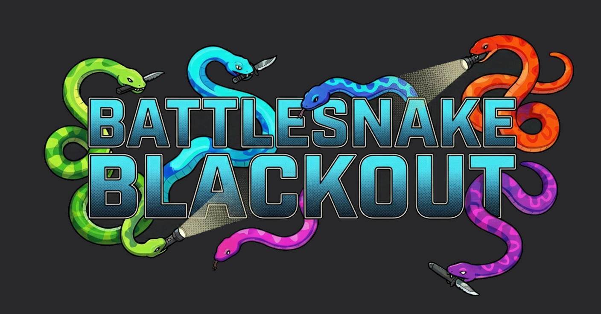
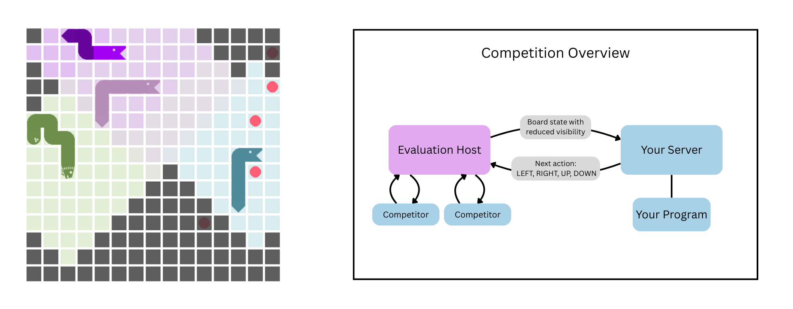

<div align="center">
</img>
</div>

# Battlesnake Blackout Starter 🐍

Welcome to the official Python starter kit for [**Battlesnake Blackout**](https://www.tnt.uni-hannover.de/bs-blackout-2026), an AI competition hosted at the **IEEE Conference on Games (CoG) 2026** with a prize pool of **$1000** (Terms and Conditions apply).

In its standard form, Battlesnake is a multiplayer game of perfect information. **Battlesnake Blackout** introduces a challenging *fog of war* mechanic. Your agent will only perceive the immediate area surrounding its head. You will need to build an AI capable of opponent modeling, trap setting, long-term strategic planning, and memory management under uncertainty.

### Attribution
This competition and starter code are based on the API and design of the popular multiplayer game [Battlesnake](https://play.battlesnake.com/). While we are not officially affiliated with the play.battlesnake.com team, we rely on their excellent API architecture and this repo is based on their [Python Starter Project](https://github.com/BattlesnakeOfficial/starter-snake-python). We encourage participants to check out their platform! If you want to use another programming language, consider adapting one of their [starter repos](https://docs.battlesnake.com/starter-projects).

#### API Changes compared to standard Battlesnake
Battlesnake Blackout extends the existing Battlesnake API:
* `game.ruleset.settings.viewRadius`: New property that defines the number of tiles your snake can see from its head.
* `board.snakes.body`: Can now contain None values to represent one or more unseen body segments.
* `board.snakes.length`: No longer provides an exact count of an opponent's length if any of their body segments are outside your view radius.

---

## Getting Started

<div align="center">
</img>
</div>

This repository contains everything you need to get a basic agent up and running.
*To participate, you will need to host your agent as a web server that responds to our game state requests. Consider using a cloud service or a port forwarding tool like [ngrok](https://ngrok.com/).*

### 1. Prerequisites
* Python 3 (Tested for Python 3.11+)

### 2. Installation
Clone this repository to your local machine:
```bash
git clone https://github.com/l-berg/battlesnake-blackout-starter.git
cd battlesnake-blackout-starter
```

Install the required dependencies. You can use either the provided `requirements.txt` or the `pyproject.toml` file depending on your preferred package manager:

**Using pip:**
```bash
pip install -r requirements.txt
```
*(Note: Ensure you are using a virtual environment!)*

### 3. Running Your Agent
Start up the `RandomAgent` located in [`random_agent.py`](random_agent.py) by running the script and specifying the port, for example:
```bash
python random_agent.py 8080
```

### 4. Verify
To verify that the Battlesnake Blackout engine can reach your agent, navigate to `http://YOUR_IP:YOUR_PORT/`. This should show some info on your agent, for example:
```json
{"author":"Chaos Itself","color":"#32CD32"}
```
Success! Your agent is now listening for requests from the Battlesnake Blackout evaluation engine. To reduce concurrency issues, the engine will only ever run one game at a time.

---

## Meet the `HungryAgent`

The [`hungry_agent.py`](hungry_agent.py) script includes a basic toolkit for handling the imperfect information mechanics of Battlesnake Blackout. 

Here is what it does out of the box:
* **Memory Management:** Because of the fog of war, you only see food when it is within your vision radius, and globally for a single tick when it spawns! The agent utilizes an `AgentState` dictionary to remember the coordinates of food it has seen until it either eats it or visually confirms it is gone.
* **Obstacle Mapping:** It creates a NumPy-based boolean grid of the board, marking visible snake body parts as impassable obstacles.
* **A\* Pathfinding:** It uses an A* search to calculate the shortest safe path to the nearest known food source.
* **Fallback Logic:** If no food is known or reachable, the agent defaults to chasing its own tail. If that fails, it picks a random safe direction to avoid immediate elimination.

---

## Local Testing & Simulation

To test your agent locally and train your algorithms, we provide **Hisss**, a high-performance C++ Battlesnake simulator with convenient Python bindings. 

You can find the simulator, documentation, and installation instructions here: 
🔗 **[Hisss Simulator Repository](https://github.com/ymahlau/hisss)**

---

**Good luck, and happy coding! May the longest snake win.**
